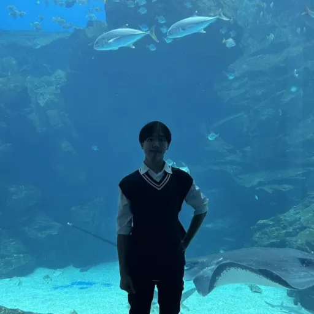

# USCC Lab 官方網站

> **塵間感知與雲端計算實驗室** · Ubiquitous Sensing & Cloud Computing Lab
> 國立成功大學 資訊工程學系（NCKU CSIE）

實驗室的雙語（繁體中文／English）官方網站。純靜態網頁、**無 build 步驟**，由 GitHub Pages 直接從 `menu` 分支發布。

🔗 **線上網址**：<https://plato.csie.ncku.edu.tw/>

---

## 目錄

- [技術概覽](#技術概覽)
- [專案結構](#專案結構)
- [頁面一覽](#頁面一覽)
- [設計系統（茶館主題）](#設計系統茶館主題)
- [互動功能](#互動功能)
- [本機預覽](#本機預覽)
- [開發與貢獻流程](#開發與貢獻流程)
- [常見維護任務](#常見維護任務)
- [外部服務](#外部服務)
- [彩蛋](#彩蛋-)
- [無障礙與效能](#無障礙與效能)
- [SEO](#seo)

---

## 技術概覽

| 項目 | 說明 |
|---|---|
| 技術 | 原生 HTML / CSS / JavaScript（無框架、無打包工具、無 `package.json`） |
| Build | **無**。檔案原樣提供，改完直接生效 |
| 部署 | GitHub Pages，發布來源是 **`menu`** 分支（**不是** `main`） |
| 字型 | Google Fonts：Noto Sans TC（內文）、Noto Serif TC（標題／品牌）、Cormorant Garamond（英文標籤） |
| 雙語 | 成對檔案：每個中文頁 `foo.html` 都有英文版 `foo_e.html` |
| 瀏覽器資料 | 訪客計數使用 counterapi.dev（免費、無需金鑰） |

---

## 專案結構

```
uscc_website/
├── index.html / index_e.html        # 首頁（中／英）
├── news.html / news_e.html          # 最新消息（競賽獲獎＋學生招生）
├── professor.html / professor_e.html# 指導教授
├── member.html / member_e.html      # 實驗室成員
├── graduate.html / graduate_e.html  # 畢業生
├── style.css                        # 全站樣式（茶館主題，單一檔）
├── script.js                        # 全站互動（單一檔，原生 JS）
├── favicon.svg                      # 網站圖示（茶綠漸層的「U」印章）
├── sitemap.xml                      # 10 個頁面 + hreflang 替代連結
├── robots.txt                       # 允許全部爬蟲、指向 sitemap
├── USCC_Lab_改版_Checklist.md        # 改版待辦清單（僅供參考，不影響網站）
└── material/
    ├── og.jpg                       # 社群分享圖（1200×630）
    ├── moment/                      # 首頁「實驗室剪影」輪播圖
    │   └── 1–9 + aiot2023-* / tsmc2024-champion / lab-*.webp  # 生活日常＋競賽得獎/活動照（含 5_2.webp hover 切換）
    ├── boss.webp               # 教授照片
    ├── jp_honor.webp             # 教授榮譽 hover 圖
    ├── tyler_pop.webp / shao_pop.webp   # 成員卡彩蛋彈出圖
    ├── apple-touch-icon.png         # iOS 圖示
    └── members/                     # 成員照片（*.webp，512×512）+ hover 音樂（*.mp3）
```

> 全站只有 **10 個 HTML、1 個 CSS、1 個 JS**。樣式與互動分別集中在 `style.css` 與 `script.js`。

---

## 頁面一覽

| 中文頁 | 英文頁 | 內容 |
|---|---|---|
| `index.html` | `index_e.html` | Hero、實驗室簡介、研究方向（AI／塵間感知／雲端）、剪影輪播、訪客計數 |
| `news.html` | `news_e.html` | 最新消息：**競賽獲獎**（近三年，JS 自動篩選）＋**學生招生**（當年度系所／缺額） |
| `professor.html` | `professor_e.html` | 指導教授 鄭憲宗 — 研究領域、學經歷、榮譽獎項 |
| `member.html` | `member_e.html` | 成員名冊：博士生 2、碩士生 11、預備生（碩零）5、實驗室助理 1 |
| `graduate.html` | `graduate_e.html` | 歷屆畢業生名單與畢業出路，依年級（110～114 級）分頁籤切換，JS 生成（`script.js` 的 `graduateDataZh` / `graduateDataEn`） |

導覽列順序：**首頁 · 最新消息 · 指導教授 · 實驗室成員 · 畢業生 · EN／中文**（語言切換永遠是最後一項，會切到同一頁的另一語言版）。

---

## 設計系統（茶館主題）

整站視覺命名為 **「Heritage Tea-House UI」**，靈感取自春水堂人文茶館：宣紙暖色、墨色文字、茶綠與金的點綴。

### 色彩 token（定義於 `style.css` 的 `:root`）

| Token | 值 | 用途 |
|---|---|---|
| `--bg` / `--bg-2` | `#f6f1e7` / `#ece2d0` | 宣紙底色 |
| `--text` / `--text-soft` / `--text-muted` | `#2c2018` / `#5e4f40` / `#736550` | 墨色文字三階 |
| `--cyan` | `#6f7d4e` | 茶綠（主要點綴） |
| `--blue` | `#a9803c` | 金 |
| `--violet` / `--pink` | `#9c4f2c` / `#b15a6a` | 赭紅 / 梅（少量） |
| `--deep` | `#4f5a37` | 深茶綠（按鈕、導覽 active、標籤） |
| `--gold-ink` / `--green-ink` | `#856222` / `#566236` | **AA 對比**的金／綠「文字」色（小字 ≥4.5:1） |

> ⚠️ 變數名（`--cyan`/`--blue`/`--violet`）是歷史相容用的舊名，實際色相已是茶綠／金／赭紅，請以註解與實際色碼為準。
> 亮色（`--blue`/`--cyan`）只用於裝飾性填色／圓點（≥3:1 即可）；**文字**請用對應的 `--gold-ink`／`--green-ink` 以符合 WCAG AA。

其他：`--radius 16px`、`--radius-sm 11px`、`--maxw 1160px`、`--grad`（茶綠→金→赭紅漸層）、`--shadow` / `--shadow-glow`。

### 可重用元件

`.nav`、`.hero`、`.section-head`（含動畫底線）、`.card`（hover 浮起＋金色頂邊）、`.chip`／`.chips`、`.badge`（脈動圓點）、`.timeline`（教授頁與消息頁共用）、`.award-list`、`.stats`/`.stat`、`.member-grid`/`.member`、`.recruit-table`、`.slideshow`（剪影輪播）、`footer.site`、`.bg-grid`（宣紙底紋）、`.skip-link`。

---

## 互動功能

全部集中在 `script.js`，核心原則是 **漸進增強（progressive enhancement）**：JS 失效或關閉時頁面仍完整可用，不會出現空白區塊。

| 功能 | 說明 |
|---|---|
| 捲動淡入（reveal） | `.reveal` 元素進入視窗才淡入，並依序錯開（IntersectionObserver）。JS 沒載入時元素一律可見 |
| 數字動畫 | `[data-count]` 統計數字捲到才開始累加 |
| 成員卡 hover 音樂 | `[data-hover-bgm]` 滑入停留 0.5 秒才載入並播放 mp3、離開即停止（`preload='none'`、觸控裝置不觸發） |
| YouTube 延遲載入 | `.yt-facade` 縮圖點擊後才換成 `youtube-nocookie` iframe |
| 導覽列／閱讀進度／回頂 | 捲動時收合導覽、頂部進度條、右下回到頂端鈕（皆由 JS 生成） |
| 訪客計數 | 串接 counterapi.dev 取得共享造訪數；連不上時退回 `localStorage` 快取 |
| 神經網路動畫 | 訪客計數卡後方的 canvas 連線動畫（離開畫面自動暫停） |
| 競賽獲獎篩選 | 競賽獲獎自動只顯示近三年（JS 依 `data-year` 隱藏；JS 關閉時全部顯示） |
| 剪影輪播 | `.slideshow` 跨淡轉場，左右箭頭／圓點／方向鍵切換、進入視窗才自動輪播；部分張可 `data-hover-src`／`data-hover-bgm` 滑入切圖配樂。JS 關閉時固定顯示第一張 |
| 彩蛋 | 見下方〔彩蛋〕 |

---

## 本機預覽

純靜態網站，用任何靜態伺服器在 repo 根目錄起一個即可（直接用 `file://` 開會因路徑問題無法正常運作，請務必起伺服器）：

```bash
# 在 repo 根目錄
python3 -m http.server 8000
# 然後瀏覽器開 http://localhost:8000/index.html
```

或者：

```bash
npx serve .
```

改完樣式／腳本後若沒看到變化，請 **Cmd/Ctrl + Shift + R** 強制重新整理清快取。

---

## 開發與貢獻流程

1. **動工前先同步**：`git fetch origin`，從**最新的 `origin/menu`** 切分支（其他人可能直接更新 repo）。
2. 建立 `feature/<主題>` 分支進行修改。
3. 遵守下列兩條硬規則（雙語、快取版本）。
4. **本機跑過、確認 console 無錯、畫面正常**才推。
5. 開 PR 回 **`menu`**；merge 即發布。

```bash
git fetch origin
git switch -c feature/my-change origin/menu
# ...修改...
python3 -m http.server 8000      # 本機驗證
git add -A && git commit -m "說明"
git push -u origin feature/my-change
gh pr create --base menu
```

### 規則一：雙語成對檔案

每個變更都要**同時改中英兩個檔**（`foo.html` 與 `foo_e.html`）。最常見的錯誤就是只改其中一個語言，導致中英不同步。

### 規則二：快取版本 `?v=`

`style.css` 與 `script.js` 的連結都帶 `?v=YYYYMMDD[字母]`（目前為 `?v=20260705d`）。

- **只有當 `style.css` 或 `script.js` 內容有改時**才需要 bump 版本號。
- bump 時要 **10 個 HTML 檔的 css 與 js 連結全部一起改成相同新值**。
- **純內容修改**（新增一則消息、新增一張成員卡）**不需要** bump。

---

## 常見維護任務

### 新增一位成員（`member.html` ＋ `member_e.html` 都要改）

成員分四組：`博士生 / Ph.D.`、`碩士生 / Master's`、`碩零 / Incoming`、`實驗室助理 / Assistant`。在對應組別的 `.member-grid` 內加一張卡：

```html
<div class="member reveal">
  <div class="photo">
    <span class="ph-init">王</span>
    
  </div>
  <div class="info"><b>王文耀</b><span>碩二</span></div>
</div>
```

- 照片放 `material/members/`，**正方形 `.webp`、512×512**。
- `.ph-init` 是照片載入失敗時顯示的字（中文姓氏／英文首字母）；`onerror` 會把壞掉的圖藏起來、露出這個字。請保留這個組合。
- 英文版用羅馬拼音名與 `Master · Y2` 之類的職級。
- 進階：要 hover 播音樂就在 `.member` 上加 `data-hover-bgm="material/members/xxx.mp3"`（滑入停留 0.5 秒播放、離開停止）；要 hover 彈出圖就把卡包進 `.member-pop-host` 並加一張 `.member-pop`。
- 新增圖片屬於內容變更，**不需** bump `?v=`。

最新消息頁有兩個分區：**競賽獲獎**與**學生招生**。兩者都在 `news.html` / `news_e.html`，**中英兩個檔都要改**。

### 最新消息：新增競賽獲獎

競賽獲獎在 `<ul ... data-awards>` 內，每筆一個 `<li data-year="YYYY">`，年份新的放上面：

```html
<li data-year="2024"><b>2024</b>台積電校園黑客松 — 廠務知識機器人組 第一名（碩士生團隊）</li>
```

- `<b>` 放年份（會自動上金色），其後接「競賽 — 名次（個人／團體）」。
- **只放三年內**：`script.js` 依 `data-year` 自動隱藏超過三年的（顯示今年與前三年，今年＝瀏覽器當下年份），舊的會自動退場、不用手動清；JS 關閉時則全部顯示。
- 最後那個 `<li class="awards-empty" data-awards-empty>` 是「近三年無紀錄」時才出現的備援，請保留。
- 純內容新增不需 `?v=` bump。

### 最新消息：更新學生招生

學生招生是一張卡片：學年度徽章 + 一個 `.recruit-table`（系所／學位學程 + 缺額）+ 來信 CTA。更新當年度招生時：

```html
<span class="badge recruit-year"><span class="dot"></span>115 學年度招生中</span>
<table class="recruit-table">
  <thead><tr><th>系所／學位學程</th><th class="count">缺額</th></tr></thead>
  <tbody>
    <tr><td>資訊工程系－人工智慧科技碩士學位學程</td><td class="count">1 名</td></tr>
  </tbody>
</table>
```

- 改學年度徽章文字；一個系所／缺額 = 一個 `<tr>`（要多收名額就多加一列）。
- 英文版 `news_e.html` 用 `Now recruiting · AY115 (2026)` 與英文系所名。

### 畢業生：新增一位畢業生（只改 `script.js`，兩個頁面共用）

畢業生頁不像成員頁把名字寫死在 HTML 裡，而是由 `script.js` 底部「Graduate page」區塊的兩個物件 `graduateDataZh`（中文）／`graduateDataEn`（英文）產生，`graduate.html` 與 `graduate_e.html` 共用同一支 `script.js`，依 `<html lang>` 自動切換資料源。

```js
'114級': [
    { name: '傅信豪', job: '華碩', photo: 'fuxinhao.webp' },
],
```

- 兩個物件的**年級與陣列順序要一一對應**：`graduateDataZh` 加一筆，`graduateDataEn` 也要在同一個年級、同一個位置加上羅馬拼音姓名＋英文公司名。
- `job` 留空字串代表「出路未提供」，畫面會顯示 `—`。
- `photo`（可省略）是 `material/graduate/` 底下的檔名；沒有照片時自動退回姓氏首字的圓形字母頭貼，圖片載入失敗（`onerror`）也會退回同一個字母。
- 新增年級（`'115級'` / `'Class of 115'`）就在物件最上面加一個新 key；tab 會依物件的 key 順序自動產生，不用改 HTML。
- 純內容新增不需 `?v=` bump。

---

## 外部服務

| 服務 | 用途 | 備註 |
|---|---|---|
| [counterapi.dev](https://counterapi.dev) | 訪客造訪計數 | namespace `usccncku` / key `site-visits`；免費、無金鑰；失敗退回 `localStorage` |
| YouTube（`youtube-nocookie`） | 首頁實驗室介紹影片 | 點縮圖才載入 iframe |
| Google Fonts | 字型 | Noto Sans/Serif TC、Cormorant Garamond |
| GitHub Pages | 主機 | `https://plato.csie.ncku.edu.tw/` |
| 聯絡信箱 | 「聯絡我們」 | Gmail 撰信連結寄至 `z10801032@ncku.edu.tw` |


---

## 無障礙與效能

- **Skip link**、鍵盤 `:focus-visible` 焦點環、AA 對比文字色（`--gold-ink`/`--green-ink`）。
- 圖片一律 `.webp` + `width/height`（避免版面跳動 CLS）+ `loading="lazy"`；YouTube／音樂延遲載入。
- 捲動事件以 `requestAnimationFrame` 節流；一次性動畫看完即 `unobserve`。

## SEO

每頁皆有：canonical、`hreflang`（zh-Hant／en／x-default）、Open Graph／Twitter 卡片、JSON-LD（首頁與成員頁為 `Organization`、教授頁為 `Person`、消息頁為 `CollectionPage`），並登錄於 `sitemap.xml`。

---

## 授權與聯絡

© 國立成功大學 資訊工程學系 · USCC Lab。
網站內容與素材版權屬實驗室所有。問題或建議歡迎透過站上「聯絡我們」與我們聯繫。
